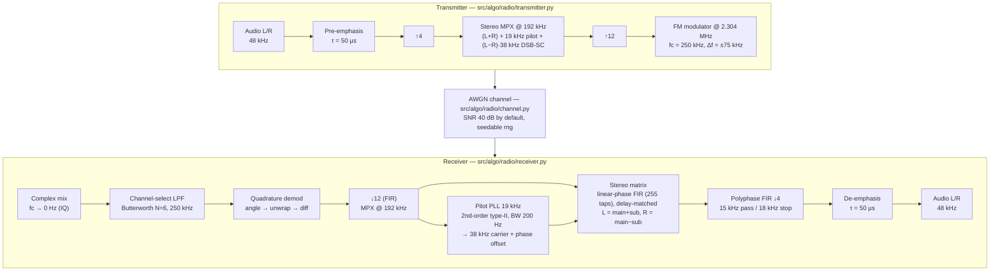

# sfumato-fm-radio-tuner

An FM stereo broadcast chain, transmitter → AWGN channel → receiver, modeled end to end in Python/NumPy. A deterministic evaluation harness measures THD, SINAD and stereo separation on every run, and a CI quality gate holds the receiver to the published spec of a commercial tuner (Sony ST-5130).

日本語版: [README.ja.md](README.ja.md)


[](https://github.com/mev-null/sfumato-fm-radio-tuner/actions/workflows/ci.yml)

[](LICENSE)
[](https://creativecommons.org/licenses/by-nc-nd/4.0/)

## Demo

The receiver decodes real stereo music at commercial-tuner quality. Quality is measured rather than eyeballed: `make eval` runs a seeded, deterministic pipeline and gates the result against the Sony ST-5130 specification.

| Metric | Current | Target (Sony ST-5130) | Status |
|---|---|---|---|
| THD (total harmonic distortion) | 0.0072 % | ≤ 0.3 % | ✅ met |
| Stereo separation (L−R) | 45.0 dB | ≥ 42 dB | ✅ met |
| SINAD (signal to noise + distortion) | 66.8 dB | ≥ 75 dB | ⏳ tracking |

Conditions: 1 kHz tone, SNR 40 dB, fixed seed (`EVAL_*` in `src/algo/settings.py`). The reasoning behind each number is recorded in the ADRs ([005](docs/adr/adr-005-demod-quality-gate.md) / [006](docs/adr/adr-006-receiver-filter-fir-iir.md) / [007](docs/adr/adr-007-stereo-separation.md)); the algorithm walkthrough is [docs/algorithm.md](docs/algorithm.md) (Japanese).

https://github.com/user-attachments/assets/f829db6a-4b2d-4762-8efc-568c4f685ed2

**Demodulated audio (stereo music):** [original](https://github.com/user-attachments/files/25324970/first_ancem92.wav) → [restored](https://github.com/user-attachments/files/28670715/first_ancem92.wav)


## How it works

### Signal chain



Diagram source: [docs/diagrams/signal-chain.mmd](docs/diagrams/signal-chain.mmd). The sample rates form an integer ladder (48 k × 4 = 192 k, × 12 = 2.304 M), and every rate, band, FM constant, PLL parameter and evaluation threshold lives in one file, `src/algo/settings.py`. Design notes are in [docs/architecture.md](docs/architecture.md).

### Module map (`src/algo/`)

| Path | Role |
|---|---|
| `radio/` | The broadcast link. `transmitter.py`: pre-emphasis, stereo MPX, FM modulation. `channel.py`: AWGN with an injectable RNG. `receiver.py`: complex mix, channel-select LPF, quadrature demod, decimation, PLL carrier recovery, delay-matched stereo matrix, plus a mono path used for measurement. |
| `dsp/` | Building blocks. `filters.py` (FIR design), `emphasis.py` (pre/de-emphasis), `pll.py` (per-sample 2nd-order type-II pilot PLL with an output phase offset; block diagram in [docs/diagrams/pll-block.mmd](docs/diagrams/pll-block.mmd)). |
| `eval/` | Quality measurement. `metrics.py` (pure functions: THD, SINAD, channel separation, PLL lock time), `harness.py` (deterministic pipeline driver and steady-state windowing), `characterize.py` (report and `baseline.json`). |
| `utils/` | WAV I/O, synthetic sources, plotting. |
| `settings.py` | Single source of truth for rates, bands, FM constants, PLL parameters and gate thresholds. |

`main.py` is the entry point for `make run`; `component/radio_ui.py` is its console UI.

### Evaluation harness and the quality-gate ratchet

`make eval` (pytest) runs the TX → AWGN → RX pipeline with a fixed seed, twice per session: once with a single 1 kHz tone for THD and SINAD, once with a left-only stereo signal for separation. The result is checked in two ways ([ADR-005](docs/adr/adr-005-demod-quality-gate.md), `tests/test_quality_gate.py`):

- **Absolute gates** are set top-down from the Sony ST-5130 spec, not from whatever the code happens to produce. A metric that has not reached its target is marked `xfail(strict=True)`: CI stays green, the gap is measured on every run, and the moment the algorithm crosses the line the test *xpasses* and turns red, which is the signal to remove the marker and promote it to a hard gate. THD and separation have been promoted this way; SINAD is still tracked.
- **A regression gate** compares every metric against `src/algo/eval/baseline.json` and fails hard on any move in the wrong direction beyond a 2 % tolerance. The baseline is rewritten only deliberately, by `make characterize`, and the diff is reviewed in the PR. If the measurement conditions change, the baseline is declared invalid instead of silently compared.

The result is a ratchet: the regression gate holds the floor, the absolute gates pull toward the spec, and "done" is a measurement rather than an opinion.

Two consequences of this setup show in the code. THD and SINAD are measured on the mono path (`_mono_decode`, L+R only) so that they characterize the FM chain itself rather than the stereo matrix ([ADR-006](docs/adr/adr-006-receiver-filter-fir-iir.md)). And separation went from 0.84 dB to 45 dB through delay-matched linear-phase FIRs, a fixed carrier phase offset, and a wider PLL loop (50 → 200 Hz) ([ADR-007](docs/adr/adr-007-stereo-separation.md)).

## Getting started

Requirements: [uv](https://docs.astral.sh/uv/) and Python 3.12+.

```bash
make install       # uv sync
make run           # TX → channel → RX simulation
make eval          # quality gate (pytest), same as CI
make characterize  # re-measure and rewrite baseline.json (deliberate)
make fmt           # ruff format + ruff check --fix
make lint          # ruff check
```

`make run` reads `inputs/first_ancem92.wav` (`settings.INPUT_FILE`) and writes the demodulated audio to `outputs/<name>_restored.wav` together with an analysis figure, `outputs/<name>_analysis.png` (time-domain overlay with residual, and PSD, per channel). If the input file is missing, a synthetic stereo test tone (time-signal pips) is generated and used instead. `inputs/` and `outputs/` are git-ignored.

## Repository layout

```
src/algo/   Python DSP model (radio/, dsp/, eval/, utils/, settings.py, main.py)
tests/      metric contract tests and the quality gate
docs/       algorithm walkthrough, architecture, roadmap, ADRs (docs/future/ holds the deferred hardware track)
inputs/     input audio (git-ignored)
outputs/    make run artifacts (git-ignored)
```

## Documentation

All documents are in Japanese.

| Document | Content |
|---|---|
| [docs/algorithm.md](docs/algorithm.md) | Algorithm walkthrough: modulation, demodulation, stereo MPX, emphasis, PLL, and the optimization record |
| [docs/architecture.md](docs/architecture.md) | Signal design (rates and bands), pipeline, package layout, evaluation harness |
| [docs/roadmap.md](docs/roadmap.md) | Progress and open items for the model |
| [docs/adr/](docs/adr/) | Architecture decision records for the model (005–007) |
| [docs/future/](docs/future/) | Deferred hardware track: FPGA plans, hardware ADRs (001–004), board-level diagram |
| [docs/philosophy.md](docs/philosophy.md) | The design philosophy behind the project name |

## Future work

**FPGA port (deferred).** The model was written so that it could be ported to hardware later: phase-critical stages use linear-phase FIRs, all sample rates are integer ratios of one another, and the PLL runs per sample. A Tang Nano 9K scaffold lives in [src/hdl/](src/hdl/README.md) with its own README and Makefile; the plans, the hardware ADRs and the board-level diagram are in [docs/future/](docs/future/). The port is not scheduled. The model is the project.

## Credits and license

- **"first_ancem92.wav"** — an original piece composed to test the fidelity of stereo FM demodulation.
  - Composition and production: mev-null © 2026
  - License: [CC BY-NC-ND 4.0](https://creativecommons.org/licenses/by-nc-nd/4.0/) (share freely with attribution; no commercial use, no derivatives)
- **Code**: [MIT License](LICENSE)
