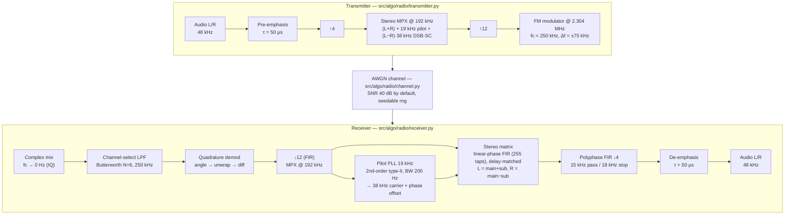

# Architecture

システム構成・信号設計の現状(設計の「現在地」)。
「なぜそう決めたか」は [adr/](adr/)、「やること/進捗」は [roadmap.md](roadmap.md) を参照。

数値の出どころは重複させない。物理定数・レート・評価条件・しきい値は `src/algo/settings.py` を正本とし、ここからは参照する。

## 全体像

FM ステレオ放送の送信〜通信路〜受信を Python/NumPy で丸ごとモデル化し、復調品質を定量評価する(`src/algo/`)。**成果物はこのモデルと評価基盤**である。
FPGA への移植は将来の拡張候補で、構想・ハードウェア構成は [future/architecture-hardware.md](future/architecture-hardware.md) に保留している(2026-08-31)。モデル側では移植を妨げない設計(位相律速段の線形位相 FIR・整数比のレート・逐次形の PLL)を保つに留める。

## 信号設計(レート / 帯域)

レートは多段で、音声 ⇄ MPX ⇄ RF の 3 層。値は `src/algo/settings.py` が正本(下表は参照用サマリ)。

| 層 | レート | 定数 | 備考 |
|---|---|---|---|
| 音声 (Audio) | 48 kHz | `AUDIO_FS` | ベースバンド音声 |
| MPX(中間) | 192 kHz | `MPX_FS` | ステレオ MPX 生成・分離用(= 48k × 4) |
| RF | 2.304 MHz | `RF_FS` | 無線帯域(= 192k × 12) |

- レート変換: RF → MPX が ×1/12(`RF_TO_MPX_FACTOR`)、MPX → 音声が ×1/4(`MPX_TO_AUDIO_FACTOR`)。送信側は逆順に ×4・×12 のアップサンプリング。
- ステレオ規格: パイロット 19 kHz(`PILOT_FREQ`)、サブキャリア 38 kHz(`SUB_FREQ`)、副搬送波帯 23–53 kHz(`SUB_BAND_LOW_HZ` / `SUB_BAND_HIGH_HZ`)。
- FM 規格: 搬送波はシミュレーション用に 250 kHz(`CARRIER_FREQ`)、最大周波数偏移 ±75 kHz(`MAX_DEVIATION`)、時定数 50 µs(`TIME_CONSTANT`)。
- 受信フロントエンド: 複素ミキシング後のチャネル選択 LPF は Butterworth 6 次・250 kHz(`IF_LPF_ORDER` / `IF_LPF_CUTOFF_HZ`)。2·fc の像を判別器の前で除去する(ADR-006)。
- 音声再生: 15 kHz 通過 / 18 kHz 阻止 / 60 dB の等リプル FIR で 192k→48k をポリフェーズ間引き(`AUDIO_BAND_HZ` / `AUDIO_LPF_STOP_HZ` / `AUDIO_LPF_STOP_ATTEN_DB`)。19 kHz パイロット漏れを断つ(ADR-006)。
- ステレオ復調: main LPF / sub BPF は同長 255 タップの線形位相 FIR(`STEREO_FIR_TAPS`)、38 kHz 再生搬送波の位相補正 4.1888 rad(`STEREO_CARRIER_PHASE_RAD`)(ADR-007)。
- PLL: ループ帯域幅 200 Hz(`PLL_BANDWIDTH`。ADR-007 で 50→200 Hz)、ダンピング 1.2(`PLL_DAMPING`)。
- 通信路: 既定 SNR 40 dB(`DEFAULT_SNR_DB`)。評価時は `EVAL_*`(1 kHz・1 秒・40 dB・seed 12345)。

## 処理パイプライン(送信 → 通信路 → 受信)

```
音声(48k) → pre-emphasis → MPX(192k) → RF(2.304M) → FM変調
   → [AWGN] →
複素ミキシング → チャネル選択 LPF → 直交復調 → ↓12 → MPX(192k)
   → PLL で 38k 再生 → 線形位相 FIR マトリクス分離 → ↓4 → de-emphasis → 音声(48k)
```

ブロック図([diagrams/signal-chain.mmd](diagrams/signal-chain.mmd)):



PLL のブロック図は [diagrams/pll-block.mmd](diagrams/pll-block.mmd)。処理の解説は [algorithm.md](algorithm.md)。

## パッケージ構成(`src/algo/`)

エントリは `main.py`(`make run`)。責務別に構成する。

- `radio/` … FM 放送リンク(基盤)。
  - `transmitter.py` … pre-emphasis → ×4 → MPX 生成 → ×12 → FM 変調(`FmTransmitter.modulate`)。
  - `channel.py` … 通信路。AWGN 付加(`add_awgn`、`rng` 注入で決定論化)。
  - `receiver.py` … RF → ベースバンド IQ → チャネル選択 → 復調 → ↓12 で MPX(`FmReceiver.process`)、搬送波再生(`_recover_carrier`)、ステレオ分離(`_stereo_decode`)、測定用モノラル経路(`_mono_decode`)。
- `dsp/` … 信号処理部品。`filters.py`(FIR 設計: 音声間引き / ステレオ main・sub)、`emphasis.py`(pre/de-emphasis)、`pll.py`(デジタル 2 次 Type-II PLL、逐次形、NCO 出力位相オフセット付き)。
- `eval/` … 品質評価。`metrics.py`(純粋関数: THD / SINAD / L-R セパレーション / PLL ロック時間)、`harness.py`(決定論パイプライン・測定窓の切り出し)、`characterize.py`(集計・`baseline.json` の読み書き)、`baseline.json`(回帰ゲートの基準)。
- `utils/` … WAV 入出力(`load_and_preprocess_wav` / `output_audio`)、合成音源(`audio_source`)、可視化(`visualizer`)。
- `component/radio_ui.py` … `make run` 時のコンソール UI / ログ。
- `settings.py` … 物理定数・レート・評価条件・しきい値の単一の出どころ。

> 旧構想の `morph/`(適応オーディオ)・`context/`(環境センシング)は**構想のみ・未作成**。内容は [future/architecture-hardware.md](future/architecture-hardware.md)、思想は [philosophy.md](philosophy.md)。

## 評価基盤(eval)

方針は [ADR-005](adr/adr-005-demod-quality-gate.md)。`make eval`(pytest)= `tests/test_metrics.py`(メトリクス契約テスト 5 件)+ `tests/test_quality_gate.py`(品質ゲート)。CI(`.github/workflows/ci.yml`)は fmt-check → lint → eval。

- **決定論パイプライン**(`harness.run_pipeline`): TX → AWGN(seed 固定)→ RX を `EVAL_*` 条件で回す。受信機は素のストリーミング出力を返し、定常区間の切り出しは harness の責務。
- **測定**: THD / SINAD は単一トーンをモノラル経路(`_mono_decode`、main=L+R)で。セパレーションは L 駆動・R 無音のステレオ復調で。PLL ロック時間は `PLL_LOCK_TOL` / `PLL_LOCK_HOLD_SAMPLES` が `None` の間は未計測(`null`)。
- **絶対しきい値ゲート**: 目標は Sony ST-5130 スペック(THD ≤0.3 % / セパレーション ≥42 dB / SINAD ≥75 dB)。未達の間は strict xfail で追跡し、到達すると xpass で昇格を促す(ラチェット)。THD・セパレーションは昇格済み(ハード)、SINAD は追跡中。
- **回帰ゲート**(ハード): `baseline.json` から悪い向きに 2 %(`REGRESSION_TOL`)を超えて外れたら fail。`conditions` 不一致なら比較しない。baseline の更新は `make characterize` による意図的操作のみ。
- **現状値**(`baseline.json`): THD 0.0072 % / セパレーション 45.04 dB / SINAD 66.8 dB。
